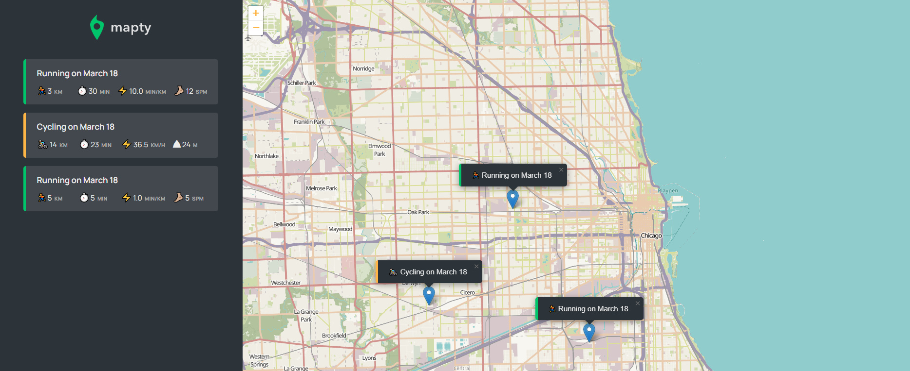

# Project-Map-Workout--OOP

# Workout Tracker Application
This repository contains the source code for a Workout Tracker application developed using HTML, CSS, and JavaScript. The application allows users to track their running and cycling workouts, view them on a map, and store them locally.

### Features:

Tracking Workouts: Users can input details such as distance, duration, and type of workout (running or cycling) through a user-friendly form.
#Display on Map: Workouts are displayed on an interactive map using Leaflet.js, allowing users to visualize their workout routes.
Storage: All workouts are stored locally in the browser's localStorage, ensuring data persistence even after the browser is closed.
Responsive Design: The application is designed to be responsive and works seamlessly across different devices and screen sizes.

 
### Technologies Used:

HTML: Markup language used for structuring the web page.
CSS: Styling language used for designing the user interface and layout.
JavaScript: Programming language used for implementing the application logic.
Leaflet.js: JavaScript library used for interactive maps.
localStorage: Web storage mechanism used for storing workout data locally in the browser.

### How to Use:

Clone the repository to your local machine.
Open the index.html file in your web browser.
Start tracking your workouts by filling out the form with the required details, then press Enter to confirm.
